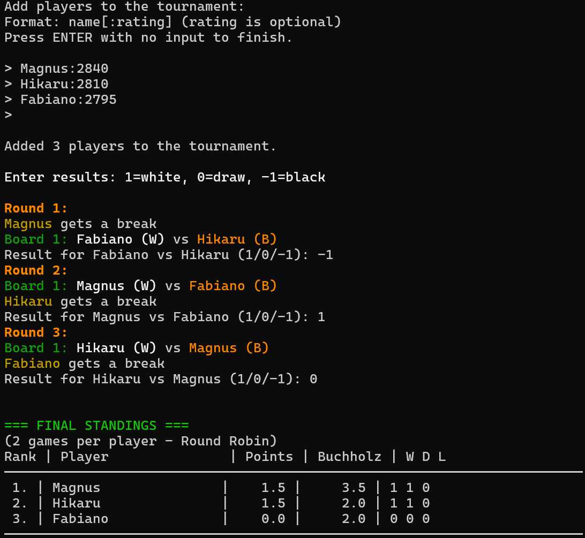

# Rust Chess Tournament Manager

Minimal CLI [round-robin](https://en.wikipedia.org/wiki/Round-robin_tournament) tournament manager.

**Features**
- Round-robin schedule (adds a bye when odd).
- Simple color balancing, CLI result input, Buchholz tiebreak.

**Quick start**
``` rust
// Requirement: rust installed
cargo run
```
- Enter players as `Name[:rating]` (rating defaults to `1200`).
- Finish input with an empty line; follow on-screen prompts for results.

**UI:**  

